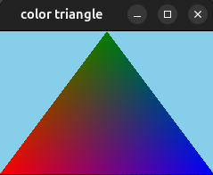

# banana engine
banana engine is a 2d graphics engine.

currently supported
- basic shape rendering
- texture rendering
- rendering to a framebuffer
- input detection (keyboard and mouse)
- bitmap font

I'm currently researching strategies to implement a gui system.

Check out the `examples` dir...

### drawing a triangle

`go run ./examples/triangle`

```golang
package main

import (
	"github.com/dfirebaugh/banana"
	"github.com/dfirebaugh/banana/pkg/input"
	"golang.org/x/image/colornames"
)

var (
	screenWidth  = 240
	screenHeight = 160
)

func update() {
	exampleControls()
	w, h := banana.GetWindowSize()
	screenWidth = w
	screenHeight = h
}

func render() {
	banana.Clear(colornames.Skyblue)
	banana.RenderShape(&banana.Polygon{
		Vertices: []banana.Vertex{
			{
				X:     0,
				Y:     float32(screenHeight),
				Color: colornames.Red,
			},
			{
				X:     float32(screenWidth / 2),
				Y:     0,
				Color: colornames.Green,
			},
			{
				X:     float32(screenWidth),
				Y:     float32(screenHeight),
				Color: colornames.Blue,
			},
		},
	})
}

func main() {
	banana.SetWindowSize(screenWidth, screenHeight)
	banana.SetTitle("color triangle")
	banana.Run(update, render)
}

var isFullScreen bool = false

func exampleControls() {
	if banana.IsKeyJustPressed(input.KeyF11) {
		isFullScreen = !isFullScreen
		banana.SetFullScreenBorderless(isFullScreen)
	}
	if banana.IsKeyJustPressed(input.KeyEscape) {
		banana.Close()
	}
}
```



